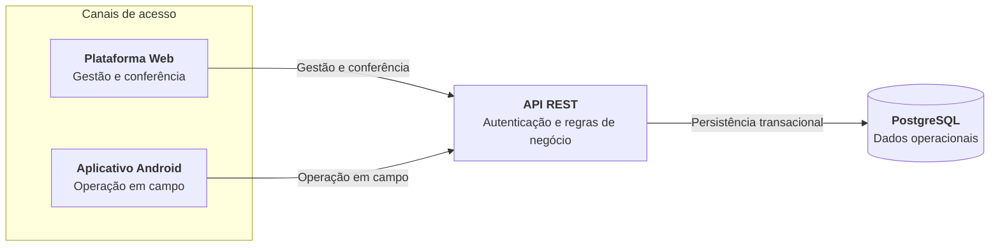

# TrackAssets

### Gestão e rastreabilidade de ativos retornáveis

O **TrackAssets** é uma plataforma da **MVCS Software** para controlar ativos retornáveis em operações logísticas. A solução conecta a gestão administrativa ao trabalho em campo para registrar entregas e recolhimentos, acompanhar saldos por cliente e manter a rastreabilidade de unidades físicas.

> Este é o repositório público de apresentação do produto. O código-fonte, a infraestrutura e as configurações operacionais da plataforma são privados e proprietários.

## Principais funcionalidades

- **Controle por quantidade ou por unidade:** permite administrar tanto saldos quantitativos quanto ativos individualizados por código, código de barras ou número de série.
- **Entregas e recolhimentos:** motoristas registram movimentações vinculadas ao cliente, ao tipo de ativo e ao veículo utilizado.
- **Fluxo de conferência:** novos registros de campo entram como pendentes e podem ser confirmados ou cancelados pela equipe responsável.
- **Saldos por cliente:** a confirmação de uma movimentação atualiza o saldo do ativo no estabelecimento.
- **Rastreabilidade de unidades:** ativos controlados individualmente mantêm sua localização de custódia e um histórico de eventos.
- **Painel operacional:** apresenta pendências, ativos em clientes, movimentações do dia e recortes por tipo de ativo.
- **Cadastros operacionais:** reúne clientes, motoristas, usuários, veículos, tipos de ativo, unidades rastreáveis e localidades.
- **Histórico e consulta:** a equipe administrativa acompanha a operação da empresa, enquanto cada motorista consulta as próprias movimentações no aplicativo.
- **Perfis de acesso:** diferencia as responsabilidades de administração da plataforma, gestão da empresa, supervisão e operação em campo.
- **Operação multiempresa:** os dados operacionais são isolados por empresa.

## Componentes da plataforma

| Componente | Responsabilidade |
| --- | --- |
| **Backend / API** | Centraliza autenticação, autorização, validação, regras de negócio, movimentações, saldos, rastreabilidade e persistência. A aplicação segue uma arquitetura em camadas e expõe uma API HTTP consumida pelos canais web e mobile. |
| **Plataforma web** | Oferece dashboards, conferência de movimentações e gestão dos cadastros da operação. A navegação e as ações disponíveis são adaptadas ao perfil autenticado. |
| **Aplicativo mobile** | Aplicativo Android voltado a motoristas e equipes em campo. Permite localizar o cliente por código, selecionar ativo e veículo, registrar entregas ou recolhimentos, adicionar observações, consultar o histórico e gerenciar o próprio perfil. |

## Arquitetura geral

O motorista registra a movimentação pelo aplicativo. A API valida o contexto da empresa e mantém o registro pendente até a conferência na plataforma web. Quando confirmado, o movimento atualiza o saldo quantitativo ou a custódia das unidades rastreáveis e passa a compor o histórico operacional.

## Tecnologias

| Área | Tecnologias confirmadas |
| --- | --- |
| **Backend** | Node.js 22, TypeScript 5, Express 5, Zod 4, Prisma ORM 7, JSON Web Tokens e bcrypt |
| **Web** | Next.js 16 com App Router, React 19, TypeScript, Tailwind CSS 4 e Lucide |
| **Mobile** | React Native 0.85, Expo 56, Expo Router, TypeScript, NativeWind e Expo SecureStore |
| **Banco de dados** | PostgreSQL 16 |
| **Infraestrutura e entrega** | Docker, Docker Compose, Yarn 4 e configuração de build mobile com EAS |

## Capturas de tela

## Sobre a MVCS Software

A **MVCS Software** — razão social **MVCS Soluções em Software Ltda.** — é uma empresa de tecnologia de Pouso Alegre, Minas Gerais, responsável pelo desenvolvimento do TrackAssets. A empresa cria soluções de software orientadas à organização de processos e ao controle de operações.

## Acesso e contato

| Canal | Link |
| --- | --- |
| **Site oficial** | [www.mvcssoftware.com.br](https://www.mvcssoftware.com.br/) |
| **Acesso à plataforma web** | [Entrar no TrackAssets](https://www.mvcssoftware.com.br/trackassets/login) |
| **Aplicativo Android** | [TrackAssets - Motorista na Google Play](https://play.google.com/store/apps/details?id=com.mvcssoftware.trackassets.driver) |
| **E-mail** | [contato@mvcssoftware.com.br](mailto:contato@mvcssoftware.com.br) |
| **Instagram** | [@mvcssoftware](https://www.instagram.com/mvcssoftware/) |

## Código-fonte e propriedade intelectual

Este repositório contém somente material institucional e documentação pública. O código-fonte do backend, da plataforma web e do aplicativo mobile não faz parte deste repositório.

O TrackAssets é um produto privado e proprietário da **MVCS Software**. Nenhuma parte da implementação interna, das configurações de ambiente ou da infraestrutura operacional é disponibilizada aqui.
